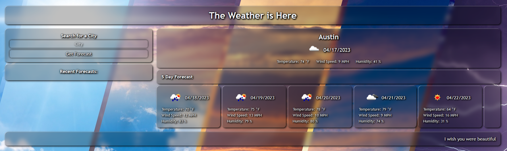

# MVR-bootcamp-challenge-6
## Server-Side API Weather Dashboard
This repository is used to call weather for a city for the current day as well as for a 5 day future forecast

## Usage
Upon loading up the repository in the web browser, the user will prompted to search for a city in request the weather data as well as be greeted with a fictitious entertain placeholder of a weather forecast. Additionally, the user will be presented with past searches as "recent forecasts" which can be recalled for search with a click rather than typing in the city again.
[Deployed application](https://vrich88.github.io/MVR-bootcamp-challenge-6/)

## Contributors
Consulting and guidance used in creation of this repository include peers and resources (in no order) as follows:
*   •Matt Montiel
*   •Brian Hamlin
*   •Lindsey Issac
*   •Daniel Cohen

## License
MIT License

Copyright (c) 2023 vrich88

Permission is hereby granted, free of charge, to any person obtaining a copy
of this software and associated documentation files (the "Software"), to deal
in the Software without restriction, including without limitation the rights
to use, copy, modify, merge, publish, distribute, sublicense, and/or sell
copies of the Software, and to permit persons to whom the Software is
furnished to do so, subject to the following conditions:

The above copyright notice and this permission notice shall be included in all
copies or substantial portions of the Software.

THE SOFTWARE IS PROVIDED "AS IS", WITHOUT WARRANTY OF ANY KIND, EXPRESS OR
IMPLIED, INCLUDING BUT NOT LIMITED TO THE WARRANTIES OF MERCHANTABILITY,
FITNESS FOR A PARTICULAR PURPOSE AND NONINFRINGEMENT. IN NO EVENT SHALL THE
AUTHORS OR COPYRIGHT HOLDERS BE LIABLE FOR ANY CLAIM, DAMAGES OR OTHER
LIABILITY, WHETHER IN AN ACTION OF CONTRACT, TORT OR OTHERWISE, ARISING FROM,
OUT OF OR IN CONNECTION WITH THE SOFTWARE OR THE USE OR OTHER DEALINGS IN THE
SOFTWARE.
